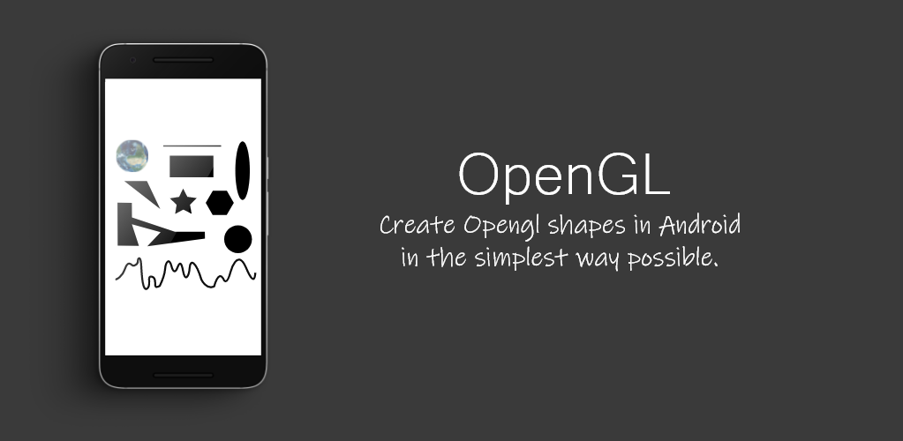

# OpenGL 
Create OpenGL shapes and apply transformations using finger gestures

<p align="center">
    
</p>
 
## About
Kotlin Library used for detecting finger gestures and applying there corresponding transformation to a 3x3 [Matrix](https://developer.android.com/reference/kotlin/android/graphics/Matrix) that is then converted in to a FloatArray that hold values for the 4x4 OpenGL matrix. That way you can apply the following transformations: scale, translation and rotation to the matrix and then use it to apply the transformations to OpenGL shapes.
 
[](http://developer.android.com/index.html)
[](https://android-arsenal.com/api?level=21)
[](https://github.com/slaviboy/OpenGL/releases/tag/v0.2.0)

Supported OpenGL shapes are:
* **Circle**  
* **Ellipse**
* **Image**
* **Line**
* **PassByCurve**
* **IrregularPolygon**
* **Rectangle**
* **RegularPolygon**
* **Triangle**

## Add to your project
Add the jitpack maven repository
```
allprojects {
  repositories {
    ...
    maven { url 'https://jitpack.io' }
  }
}
``` 
Add the dependency
```
dependencies {
  implementation 'com.github.slaviboy:OpenGL:v0.2.0'
}
```
 
### How to use
Adding shapes is easy, the code below is example of creating a OpenGL rectangle. To learn more on how to implement your own OpenGL view and draw the shapes you can read the official wiki page [here](https://github.com/slaviboy/OpenGL/wiki).
```kotlin

// gesture detector used for applying transformations to all OpenGL objects: line, images, triangles..
val mainGestureDetector: OpenGLMatrixGestureDetector = OpenGLMatrixGestureDetector()

// create program for shapes that use the same colors
val singleColorsProgram = OpenGLStatic.setSingleColorsProgram()

// create single rectangle
val rectangle = Rectangle(
     x = 300f,
     y = 200f,
     width = 300f,
     height = 150f,
     color = Color.BLACK,
     strokeWidth = 5f,
     gestureDetector = mainGestureDetector,
     preloadProgram = singleColorsProgram,
     style = Shapes.STYLE_FILL
)
```
